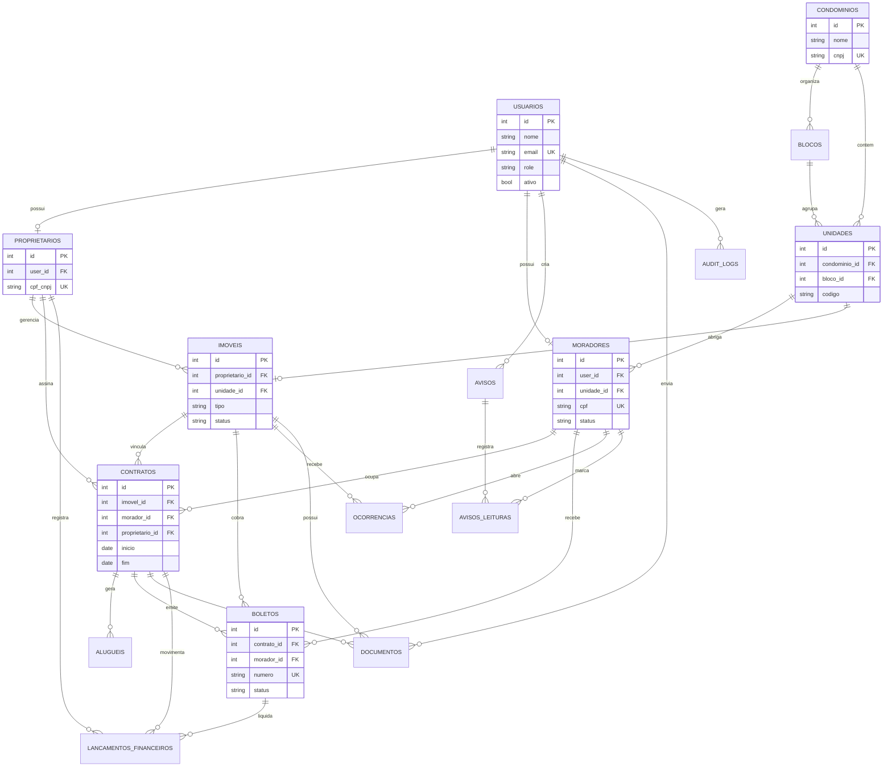

# Modelo Entidade-Relacionamento

```mermaid
erDiagram
    USUARIOS ||--o| PROPRIETARIOS : possui
    USUARIOS ||--o| MORADORES : possui
    USUARIOS ||--o{ AVISOS : cria
    USUARIOS ||--o{ DOCUMENTOS : envia
    USUARIOS ||--o{ AUDIT_LOGS : gera

    PROPRIETARIOS ||--o{ IMOVEIS : gerencia
    PROPRIETARIOS ||--o{ CONTRATOS : assina
    PROPRIETARIOS ||--o{ LANCAMENTOS_FINANCEIROS : registra

    CONDOMINIOS ||--o{ BLOCOS : organiza
    CONDOMINIOS ||--o{ UNIDADES : contem
    BLOCOS ||--o{ UNIDADES : agrupa
    UNIDADES ||--o{ MORADORES : abriga
    UNIDADES ||--o| IMOVEIS : referencia

    IMOVEIS ||--o{ CONTRATOS : vincula
    IMOVEIS ||--o{ BOLETOS : cobra
    IMOVEIS ||--o{ OCORRENCIAS : recebe
    IMOVEIS ||--o{ DOCUMENTOS : possui

    MORADORES ||--o{ CONTRATOS : ocupa
    MORADORES ||--o{ BOLETOS : recebe
    MORADORES ||--o{ OCORRENCIAS : abre
    MORADORES ||--o{ AVISOS_LEITURAS : marca

    CONTRATOS ||--o{ ALUGUEIS : gera
    CONTRATOS ||--o{ BOLETOS : emite
    CONTRATOS ||--o{ DOCUMENTOS : anexa
    CONTRATOS ||--o{ LANCAMENTOS_FINANCEIROS : movimenta

    AVISOS ||--o{ AVISOS_LEITURAS : registra
    BOLETOS ||--o{ LANCAMENTOS_FINANCEIROS : liquida

    USUARIOS {
      int id PK
      string nome
      string email UK
      string role
      bool ativo
    }
    PROPRIETARIOS {
      int id PK
      int user_id FK
      string cpf_cnpj UK
    }
    MORADORES {
      int id PK
      int user_id FK
      int unidade_id FK
      string cpf UK
      string status
    }
    CONDOMINIOS {
      int id PK
      string nome
      string cnpj UK
    }
    UNIDADES {
      int id PK
      int condominio_id FK
      int bloco_id FK
      string codigo
    }
    IMOVEIS {
      int id PK
      int proprietario_id FK
      int unidade_id FK
      string tipo
      string status
    }
    CONTRATOS {
      int id PK
      int imovel_id FK
      int morador_id FK
      int proprietario_id FK
      date inicio
      date fim
    }
    BOLETOS {
      int id PK
      int contrato_id FK
      int morador_id FK
      string numero UK
      string status
    }
```

